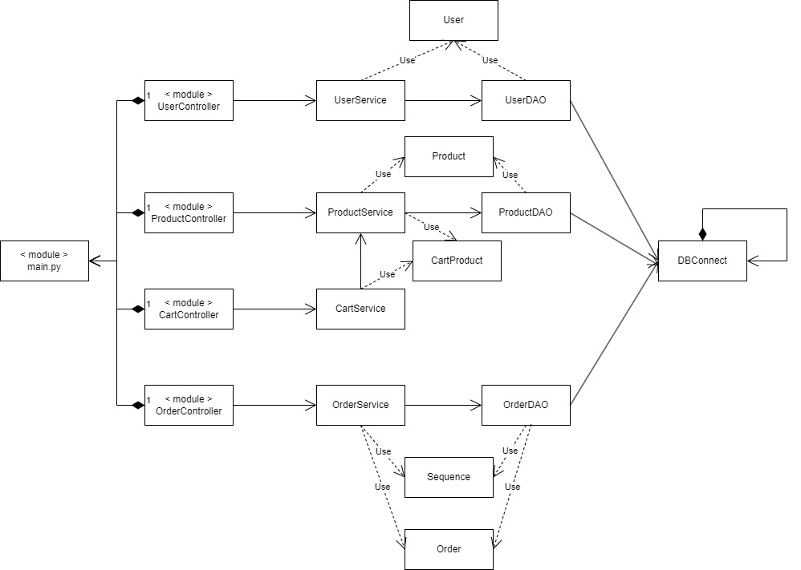

# Demo
## https://shop.shbox.kr

# 인터프리터 설정
파이참 환경에서 실행을 기준으로 합니다.

파이참 setting - Project:FlaskWebapp에 들어가서 Python Interpreter 설정을 해주세요. 현재는 설정되어 있지 않습니다. 파이썬은 3.8 이상에서 정상 작동합니다. 파이썬 프로젝트에 인터프리터를 설정하는 방법은 검색을 통해 알아낼 수 있습니다.
인터프리터 설정 이후에는 아래의 실행 단에서 설명하고 있는 필수 패키지들을 설치해주세요.

# 초기 설정
DBConnect/DBConnect.py 파일에서 DB 설정을 해주세요.
```python
from mysql.connector import pooling
import mysql.connector
class DBConnect():
    def __new__(cls):
        if not hasattr(cls, 'instance'):
            cls.instance = super(DBConnect, cls).__new__(cls)
        return cls.instance

    def __init__(self):
        self.pool = pooling.MySQLConnectionPool(
            pool_name='db_pool',
            pool_size=10,
            pool_reset_session=True,
            host='',
            port=,
            database='',
            user='',
            password='',
        )

    def getConnection(self):
        return self.pool.get_connection()
```
원격 DB를 사용하려면 다음과 같이 작성하고, host, port, database, user, password는 개발자에게 문의해주세요.

그게 아니라면 mysql을 설치하고 데이터베이스를 생성한 뒤, Database 디렉토리의 스키마를 바탕으로 테이블들을 구성해주세요. 이후, 해당 DB 정보를 사용하시면 됩니다.

## ++추가: Database 추가 설정 관련 내용
1) mysql을 설치합니다. 현재 5.X 버전 기준으로 작성되어 있습니다. 가장 최신 버전은 8.X인데 호환성은 장담할 수 없습니다.
2) mysql 설치가 끝나면 명령 프롬포트 창 (CMD) 에서 버전을 확인할 수 있습니다. (```mysql -version```)
3) CMD에서 mysql에 접속합니다. 최초 설치 시 데이터베이스 아이디와 비밀번호를 설치하는데 해당 값을 가지고 접속할 수 있습니다. (```mysql -u 아이디 -p```)
4) 접속이 완료되면, 아무 데이터베이스를 하나 생성합니다. (```create database shoppingmall;```, shoppingmall 이라는 데이터베이스를 예시로 생성하였습니다)
5) 해당 데이터베이스에 접근하여 작업을 수행하도록 합니다. (```use shoppingmall```)
6) 프로젝트의 Database 폴더 안에 있는 jiwonshop.sql 파일 안의 내용을 전부 복사해서 붙여넣습니다. 또는 명령어를 통해 해당 파일을 mysql에서 실행합니다. (```source 프로젝트경로/FlaskWebapp/Database/jiwonshop.sql```)
7) 다음으로는 상품 데이터들을 채워넣습니다. 마찬가지로 명령어를 통해 실행합니다. (```source 프로젝트경로/FlaskWebapp/Database/product.sql```)
8) 초기 설정 단계에서 DBConnect.py에 나한테 설치된 데이터베이스 정보를 입력합니다. 기본적으로 host는 'localhost', port는 '3306', database는 아까 생성한 데이터베이스 이름 'shoppingmall', user와 password는 mysql 아이디와 비밀번호를 입력해주면 됩니다.

# 실행
파이썬 인터프리터를 설정하고 requirements.txt에 적혀있는 패키지들을 설치해주세요.
+ flask
+ flask_cors
+ mysql-connector-python

main.py를 실행하고, configuration을 다음의 사진과 같이 맞춰주세요.


이제 실행이 됩니다.

# ERD


# Class 다이어그램


# 도커 환경에서의 배포
```
docker build -t flask:1.0.0 .
```

# 문의
이외에 오류는 깃의 Issue 탭에서 New 버튼을 통해 이슈를 생성하여 문의를 남길 수 있습니다.